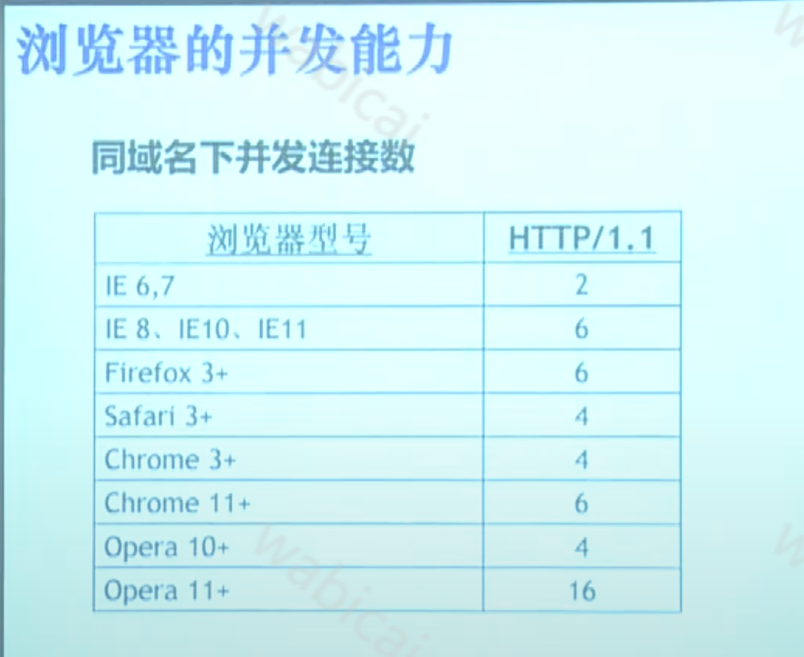
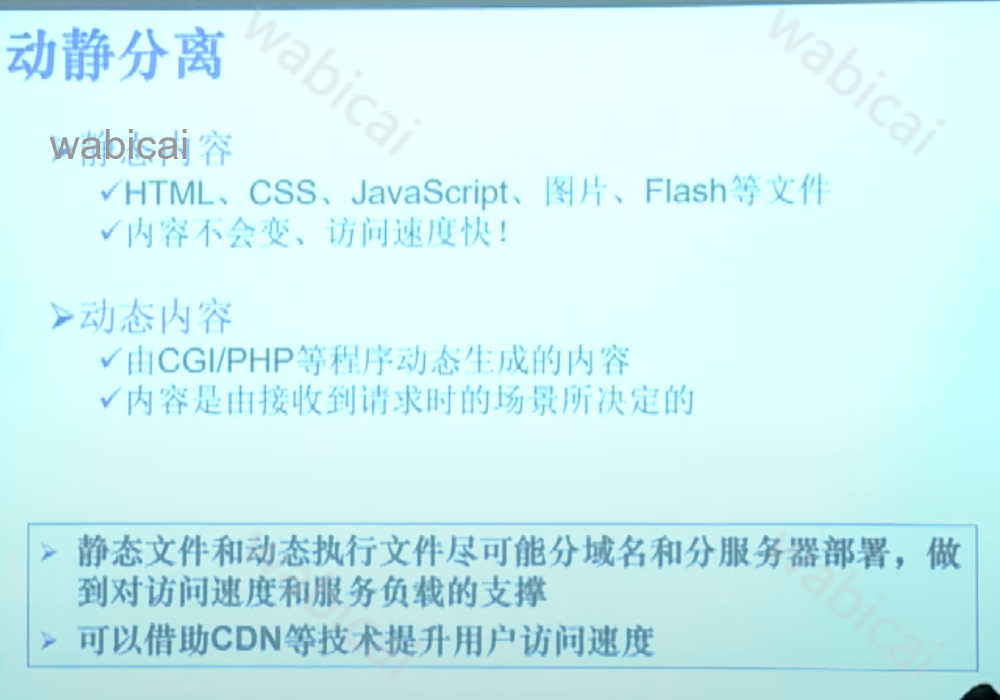

## 网页打开标准
1. 最满意要在【2秒】内打开
2. 要缩短在【八秒】内打开

# 提速方案

## 压缩
1. 文本文件压缩
   1. CSSS/HTML/JS空格、注释、换行等基于冗余的压缩
   2. JS的Minify（混淆）
2. Web端压缩
   1. 使用Gzip、Compress对下行Response内容的压缩
   2. 但会对Web端性能有一定影响。
   3. 不用在图片上面，因为图片一般都已经压缩过了。
   4. 需要HTTP协议进行支持
      1. 请求头：Accept-Encoding：compress，gzip。返回头：Content-Encoding。
 
## 缓存
1. 浏览器本地缓存
2. 反向代理服务器缓存
    1. 缓存服务器将多个相同请求，直接返回。
    2. 需要HTTP协议进行支持
       1. Expires：HTTP1.0规范
       2. Cache-control：HTTP1.1规范
       3. If-Modified-Since/Last-Modeified(时间戳可能不匹配)
          1. 分布式服务
          2. 精度只到秒级
       4. ETag/If-Node-Match
3. 如何使缓存失效？
    1. 改变请求URL

## 并发

## 动静分离
> 分不同域名存放
1. 服务器资源占用问题
2. Cookie

## Cookie
1. 设置Cookie方式
   1. Request包携带Cookie
   2. Response设置Cookie

## 雅虎34条军规
### 1. 减少HTTP请求次数
1. Cache
   1. 本地缓存、反向缓存
   2. 尽量缓存Ajax
2. 合并文件
   1. Image map
   2. CSS Sprite
   3. 合并JS、CSS
### 2. 内容优化
1. 避免跳转。（HTTP Request头信息）
2. 用域名划分页面内容
   1. 动静分离
   2. 不同域名下的文件可以并行加载
3. 减少DNS查找时间
   1. 减少域名数量
   2. 浏览器缓存、host缓存
   3. 与第二点有点矛盾。
4. 减少DOM元素
5. 避免404，减少304
   1. 404占用流量，又影响体验
6. 推迟加载/提前加载
### 3. 服务器优化
1. CDN
2. Expires或Cache-control
3. Gzip压缩
### 4. CSS和JavaScript
1. CSS
   1. 把CSS文件置于顶部。（避免DOM树解析完还要重新渲染。因为CSS边解析边渲染)
   2. 使用外部CSS 
      1. 可以缓存
      2. 可以动态加载
   3. 避免使用CSS表达式
   4. 使用link 代替@import。（import有一定随机性）
2. JavaScript
   1. Javascript置于底部。（不会并行加载其他资源，有可能会堵塞)
   2. 使用外部JS

## 请求的六个阶段
1. Blocked：查找缓存、等待网络
2. DNS Lookup：域名解析
   1. 时间片长: DNS服务器配置问题、DNS网络问题。不然只能找运营商了
3. Connection：连接服务器。（TCP）
   1. 路由可能有问题
   2. 连接之后的话，有可能是堵塞了。
4. Send：发送HTTP
5. Wait：等待回包
6. Receive：接受HTTP包
## 一：请求的数据响应时间时长时短，原因？处理方式？

## 二：首屏加载的优化有哪些？

比如进入的时候，白屏时间非常长，打开调试工具发现network有很多图片，还有JS文件非常大怎么解决？

## 三：秒杀系统前端和后端优化？

## 四：浏览器页面空白的原因有哪些?

　1). 可能在head 标签里放置了大量的 script 标签，导致浏览器必须等到全部javascript代码都被下载、解析、执行完成以后，才能开始呈现页面的内容

　　2). 可能是后端出现问题，并且禁用了错误输出。比如apache2，后端配置无错误输出，并且服务状态500，这个时候页面就是一片空白

